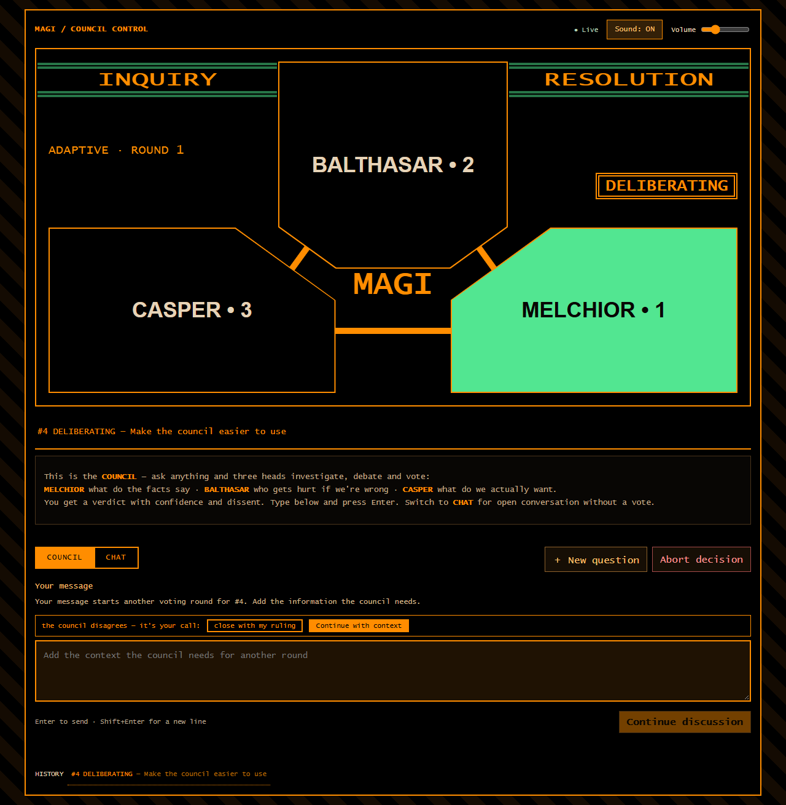
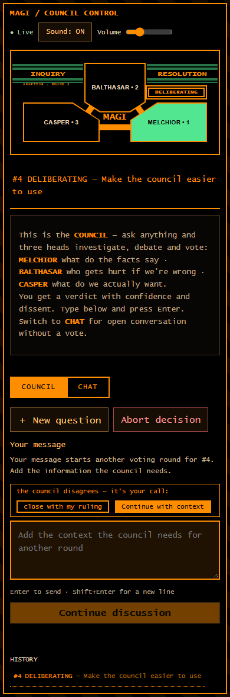

# ClaMi — Sistema MAGI

Un **consejo MAGI de tres cabezas** (Melchior / Balthasar / Casper — la persona
vive en el asiento, el proveedor es intercambiable: kimi, codex, claude,
Ollama, cualquier CLI o API OpenAI-compatible) que deliberan sobre tus
preguntas y votan decisiones con ruling, minority report, cambios de parecer
entre rondas y arbitraje humano. Con **memoria**: un grafo local que ingiere
tus sesiones y decisiones y se inyecta en cada deliberación. Y en modo
**producción**: el consejo aprueba un plan, un ejecutor lo implementa en una
rama, el consejo revisa el diff y —si aprueba unánime— se mergea solo.

La interfaz es una web estilo MAGI (diseño de TomaszRewak/MAGI) con una sola
caja de texto, como un CLI. Corre en Windows, macOS y Linux.





## Qué necesitás para arrancar (desde cero, en cualquier máquina)

1. **Python 3.14+**.
2. **Postgres accesible** (cualquier instalación estándar; el default del
   sistema es `dbname=debate host=localhost`, puerto 5432, usuario = tu
   usuario del SO). Si no tenés ninguno, en Windows el repo trae un
   postmaster portable en `experiments/pg` y `bin\start-magi.bat` lo levanta.
3. **Al menos una cabeza** (sin cabezas el sistema corre "degradado" y sólo
   vos podés cerrar decisiones):
   - **kimi** (u otro agente CLI con MCP: claude, …) — investiga el repo con
     herramientas y vota por MCP;
   - **codex** u otro CLI de texto plano — vota con el journal inlineado en el
     prompt (modo `journal: "inline"`);
   - **Ollama / LM Studio / cualquier endpoint OpenAI-compatible** — cabeza
     API local sin costo.
   Todo se configura en `debate-mcp/heads.json`; no hace falta tener las tres.
4. Opcional: cuenta de **OpenAI** (codex) y/o **Moonshot** (kimi) si usás esas
   cabezas cloud.

## Instalación y primer arranque

```bash
git clone https://github.com/Adrian-Sandwich/ClaMi.git
cd ClaMi/debate-mcp

# venv (Windows: .venv\Scripts\python -m venv .venv)
python3.14 -m venv .venv && .venv/bin/pip install -r requirements.txt

# base de datos (idempotente; crea el esquema o aplica lo que falte)
.venv/bin/python schema/migrate.py

# ¿todo bien? (necesita Postgres arriba)
.venv/bin/python smoke_test.py
```

Atajos por sistema:

- **Windows**: `debate-mcp\bin\start-magi.bat` levanta Postgres portable (si
  no corre), migra y abre relay + UI en ventanas propias.
  `debate-mcp\bin\stop-magi.bat` baja todo.
- **macOS/Linux**: `.venv/bin/python relay.py` y `.venv/bin/python magi_ui.py`
  (daemonizalos como prefieras; `launchd/install.sh` es la vía macOS).

Después abrí **http://127.0.0.1:8051**.

**Registrar el MCP en tus agentes** (para que las cabezas CLI vean el
tablero): el repo trae `.mcp.json` en la raíz — cualquier agente que corra
desde el repo lo carga solo (en Windows apunta a
`.venv/Scripts/python.exe`; en macOS/Linux cambialo a `bin/python`). Para
config global, tu agente suele tener un comando tipo `kimi mcp add` /
`claude mcp add` apuntando a `debate-mcp/server.py` con el python del venv.

**Grafo de memoria** (opcional pero recomendado): corre
`memory-graph/refresh.sh` una vez (ingiere sesiones de tus agentes, decisiones
y READMEs a `memory-graph/memory.db`) y agendalo (Windows:
`schauska... schtasks //create //tn "ClaMi-memory-refresh" //tr "...bash... refresh.sh" //sc hourly`;
macOS/Linux: cron o launchd). Sin grafo, el sistema funciona pero las
cabezas no recuerdan nada.

Estado del sistema en cualquier momento: `.venv/bin/python healthcheck.py`.

## Cómo se usa (la web, en 30 segundos)

Una sola caja de texto con dos modos (tabs arriba a la izquierda):

### COUNCIL — consultas con votación

Tu mensaje se somete al consejo. Si no hay ninguna decisión abierta, **abre
una decisión nueva**: las tres cabezas investigan (las CLI pueden leer el
repo; todas ven el journal y la **memoria del grafo**) y votan en paralelo:

- **APPROVED / REJECTED**: mayoría 2/3 o unánime.
- **CONDITIONAL**: aprobado con condiciones (quedan en el dossier).
- **STALEMATE**: no hubo acuerdo. El consejo te escribe una **consulta**:
  elegí **Continue with context** para otra ronda o **Close with my ruling**
  para cerrarla con tu decisión. Escribí el contexto o ruling y pulsá enviar.

Si seleccionaste una decisión abierta o en STALEMATE, tu mensaje va **a ella**:
contexto si está deliberando; en STALEMATE elegís explícitamente continuar
o cerrar. Continuar es la opción inicial y los botones conservan tu texto.

La UI envía el ID de la decisión seleccionada. Si se cerró antes de recibir
el mensaje, responde con un error en vez de enviarlo a otra. En una decisión
en ejecución, el texto agrega contexto y **"seguí"** habilita el reintento
si falló. El historial del fallo se conserva. **New question** prepara otra
consulta sin enviarla. El botón de envío indica **Ask council**, **Start
production**, **Add context** o la acción seleccionada. El repositorio solo
se ofrece al abrir una decisión. Durante una desconexión se pausa el envío;
los errores conservan el borrador y no se reintenta automáticamente.

**Sound: OFF / ON** activa señales originales 100% sintetizadas, con estética
MAGI/Evangelion: blip de consola al enviar, campana cuando una cabeza vota,
motivo de veredicto (raíz–tritono–octava) y una alerta grave de dos notas
cuando el consejo se trabó o falló la ejecución. Arranca apagado, ofrece
volumen y recuerda la preferencia localmente. No reproduce grabaciones ni
música de Evangelion: todo se sintetiza en el momento con WebAudio.
La primera carga y las reconexiones no reproducen avisos históricos.
Los triángulos conservan la estética MAGI, admiten teclado y abren el
razonamiento en un diálogo que se cierra con Escape. La interfaz se adapta
a móvil y respeta la preferencia del sistema de reducir movimiento.

Las pruebas opcionales de navegador están en `tests/test_ux_browser.py`:
requieren Playwright y `CLAMI_BROWSER_PATH` apuntando a Chrome o Chromium.
Interceptan todas las solicitudes y nunca envían mensajes al tablero real.

### CHAT — charla libre con las tres cabezas

Tu mensaje abre ronda en un thread compartido y las cabezas responden en
turno, cada una desde su eje (Melchior: verdad técnica · Balthasar: riesgo y
cuidado · Casper: lo que realmente querés vos). Pensá en "preguntarle a tres
colegas a la vez", no en una votación. El chat también cierra con dos
veredictos cruzados o cuando arbitrás.

**¿Cuándo cuál?** COUNCIL cuando querés una **decisión con respaldo** (¿hago
X?, ¿mergeamos?, ¿qué enfoque elijo?) — queda auditada con confianza y
minoría. CHAT cuando querés **explorar ideas, opiniones o discusión** sin
formalidad.

### Los `#n` (la fila de chips de colores)

Cada decisión tiene un número: `#12`. Los chips abajo son tu **historial** —
click y volvés a ver esa deliberación con su conversación. El color es el
veredicto: verde APPROVED, rojo REJECTED, naranja CONDITIONAL, azul INFO, gris
STALEMATE. `#4 CONDITIONAL` significa "la decisión 4 cerró con condiciones".

### Cambiar de repo o carpeta de trabajo

El campo **"repo folder for production runs"** bajo la caja: pegá la ruta
(`C:\src\mi-repo`) y esa consulta (y solo esa) trabaja sobre ese repo — las
cabezas CLI lo investigan con cwd ahí. Sin repo, las decisiones usan el repo
del sistema (ClaMi) o el default del relay (`DEBATE_DEFAULT_CWD`).

### Producción al seleccionar un repo

Con un repo seleccionado, la consulta es un **plan para que el sistema lo
ejecute**. La UI anuncia esa intención antes de enviar:

1. El consejo **delibera el plan** (como cualquier decisión).
2. Si lo aprueba, el **ejecutor** (el asiento con `"executor": true` en
   heads.json, por defecto Melchior/kimi) lo implementa en la rama
   `magi/d<n>` en un **worktree propio**, partiendo del commit base guardado.
   Tu directorio y tus archivos sin commit quedan fuera de esa ejecución.
3. Se abre una **revisión** del commit exacto generado. Las cabezas inspeccionan
   el worktree; el dossier guarda el ID de revisión, SHA base y SHA revisado.
   Si el ejecutor deja cambios sin commit, la ejecución falla antes de revisar.
4. Unánime → se prepara un **merge `--no-ff` en un worktree de integración**
   y se avanza tu rama con `--ff-only`. Se exige la misma rama base, el mismo
   commit base, directorios limpios y el commit revisado intacto. El contenido
   del merge debe coincidir con el aprobado. Mayoría 2/3, rechazo o cambios
   posteriores → **MERGE PENDING**, con el motivo en el journal.

Sin repo, la decisión sólo se **decide**; con repo, además se **hace**.
Las condiciones de los votos `conditional` de la ronda aprobada se conservan
para el ejecutor, incluidas las de la mayoría. Si la ejecución falla, espera
un reintento explícito; los fallos no se borran del journal.

Los worktrees se conservan en `<git-common-dir>/magi-worktrees/` para inspección
y recuperación. "seguí" reutiliza el worktree de ejecución y abre una revisión
nueva; nunca cambia silenciosamente la base del plan. Si tu rama base avanzó,
abrí un plan nuevo sobre esa base o resolvé la integración manualmente.
Un bloqueo de Postgres por repositorio coordina los ejecutores y merges de los
relays que usan esa base de datos. Evitá operaciones Git manuales concurrentes
durante el paso final de integración: ese bloqueo sólo coordina a los relays.

Las revisiones antiguas, sin un commit y un ID de revisión vinculados al plan,
no habilitan auto-merge. Se conservan para resolución manual. No hace falta una
migración de esquema: los datos nuevos se guardan en el dossier JSON existente.

## Configurar las cabezas (`debate-mcp/heads.json`)

```jsonc
{
  "seats": [
    { "seat": "melchior", "name": "kimi", "type": "cli",
      "bin": "~/.kimi-code/bin/kimi.exe", "args": ["-p"],
      "executor": true },               // <- ejecuta planes aprobados
    { "seat": "balthasar", "name": "codex", "type": "cli",
      "journal": "inline",              // <- sin MCP: voto parseado del stdout
      "bin": "C:/.../debate-mcp/bin/codex.cmd", "args": ["exec"] },
    { "seat": "casper", "name": "qwen2.5-coder", "type": "api",
      "model": "qwen2.5-coder:1.5b",
      "base_url": "http://127.0.0.1:11434/v1", "timeout_secs": 600 }
  ]
}
```

- **type `cli`** (default): proceso con herramientas. Si el agente carga el
  MCP del repo (como kimi/claude), vota con `cast_position`. `"journal":
  "inline"` es para CLIs que no cargan MCP (codex exec): el relay inlinea el
  journal en el prompt y parsea el tag `POSITION:` de la salida. El modelo lo
  fijás en `args` (p. ej. codex: `"args": ["exec", "-m", "gpt-5.1"]`); sin
  flag usa el default de tu CLI.
- **type `api`**: POST a un endpoint OpenAI-compatible (Ollama, LM Studio,
  llama.cpp). El journal va inlineado; mismo contrato de voto.

Las personas (ejes y sesgos) viven en `debate-mcp/personas.py` — el
proveedor es un detalle de wiring. Cambiar de modelo es editar heads.json,
nada más.

## Arquitectura en una mirada

```
                 ┌─────────────────────────────── http://127.0.0.1:8051
   vos ─────────┤  magi_ui.py (stdlib+SSE)  ────┐
                 └───────────────────────────────┤
        ┌───────────────────────────────────────┴───────────┐
        │              Postgres "debate"                    │
        │   decisions · positions · messages (journal)      │
        └───────────────────────────────────────┬───────────┘
                                     LISTEN/NOTIFY│ decision_all / debate_all
        ┌───────────────────────────────────────┴───────────┐
        │  relay.py — orquestador de turnos (daemon)        │
        │  dispara las 3 cabezas en paralelo · ejecutor     │
        │  (modo producción) · auto-merge · memoria         │
        └───────────────────────────────────────┬───────────┘
        ┌───────────┬───────────┬───────────────┴───┐
     kimi (CLI)  codex (CLI)  qwen (API/Ollama)   ejecutor
     MCP tools   journal inline  POSITION: tag    (kimi, rama magi/d<n>)
        └───────────┴───────────┴───────────────────┘
        ┌───────────────────────────────────────────┐
        │  memory-graph: SQLite + ingestors horarios │
        │  (sesiones, decisiones, docs → memoria)    │
        └───────────────────────────────────────────┘
```

El motor de decisiones (`decision.py`) es puro y testeable; el tablero
(`board.py`) concentra las escrituras; `server.py` expone el MCP; el relay
orquesta procesos con candados por asiento, topes de disparos y wake corto
con pendientes.

## Tests

```bash
debate-mcp/.venv/bin/pip install -r debate-mcp/requirements-dev.txt
debate-mcp/.venv/bin/pytest
```

La suite incluye repositorios Git temporales para comprobar worktrees, reintentos
y merges. Para verificar además el ciclo completo con Postgres, configurá
`CLAMI_TEST_POSTGRES_DSN` antes de ejecutar pytest. Esas pruebas crean tablas
temporales privadas y restringen `search_path` a `pg_temp`; no escriben en las
tablas del tablero. Sin esa variable se omiten.

## Notas de operación

- Conexión a otra base/servidor: `DEBATE_CONNINFO` (conninfo estándar de
  libpq). El default no fija usuario: usa el del SO.
- La UI y el relay tardan lo que tarden las cabezas: los modelos cloud
  (kimi/codex) tardan ~15s–5min por turno; Ollama en CPU depende del tamaño
  del modelo (los de 1.5–3B responden en segundos, los 7–8B en minutos). El
  indicador THINKING te muestra quién está deliberando.
- `healthcheck.py` vigila Postgres, el relay (heartbeat), decisiones viejas
  abiertas y el grafo stale. Exit 0/1/2 para agendarlo.
- Los `test_canary_*` se saltan solos si no hay logs reales de agentes.
- Seguridad: las cabezas CLI corren con permisos de escritura en el cwd —
  por eso el modo producción trabaja en rama propia y el relay tiene topes
  de disparos por thread/decisión.
